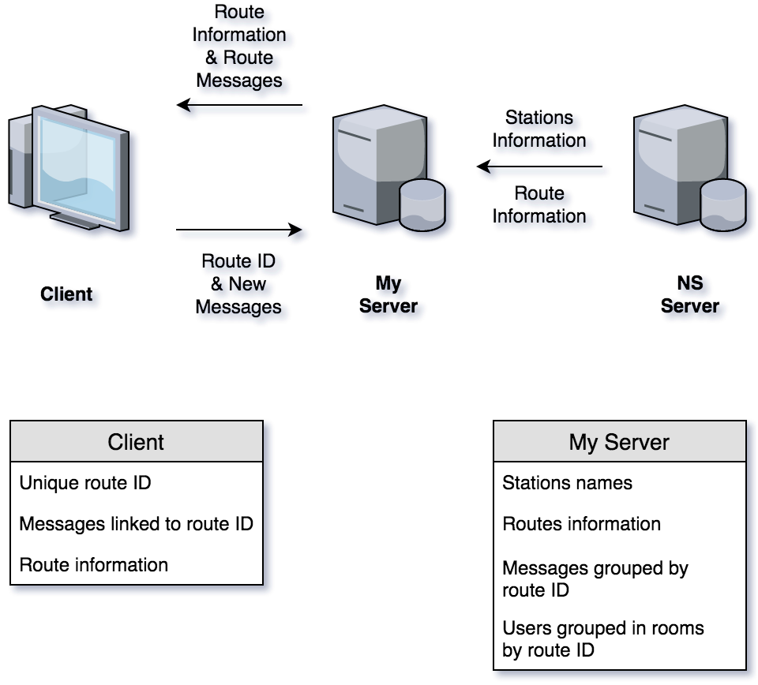

# Real Time Web Project: Route Planner

Live deployed demo can be found [here](https://real-time-web-project-pgnkawrqjc.now.sh/).

<!-- TOC -->

* [Real Time Web Project: Route Planner](#real-time-web-project-route-planner)
  * [Getting Started](#getting-started)
    * [Installing](#installing)
    * [Usage](#usage)
  * [Project Description](#project-description)
  * [Project Features](#project-features)
  * [External Data Source](#external-data-source)
  * [Data Managment & Socket Events](#data-managment--socket-events)
    * [Data Managment](#data-managment)
      * [Server](#server)
      * [Client](#client)
    * [Socket Events](#socket-events)
  * [TO-DO & Wishlist](#to-do--wishlist)
  * [Authors](#authors)
  * [License](#license)

<!-- /TOC -->

## Getting Started

These instructions will get you a copy of the project up and running on your local machine for development and testing purposes.

### Installing

After cloning the repository you can install the required dependencies using npm:

```javascript
$ npm install
```

### Usage

In order to launch a development environment:

```javascript
$ npm start
```

## Project Description

For this project, I had to build a real-time web application using an external API as source data. Some of the project requirements where: Users must be able to manipulate the data model or make new API requests, data management and manipulation, multiple client support while only serving the appropriate data to each client and keeping users informed about server and API status.

In my case, I chose to build a train route planner using the NS API. Where users can send messages to each other when sharing the same route. My objective was providing an updated experience to users without relying on outdated information from the API.

This application is real-time by leveraging the power of [Socket IO](https://socket.io/) a web-sockets implementation for node.js. Furthermore, this project uses the [Pug](https://pugjs.org/api/getting-started.html) templating language, because well, i really like dogs.

## Project Features

* A working route planner.
* Real-time messaging system using Socket IO.
* Users sharing the same route are connected within unique rooms.
* New data is only displayed after the server gives an OK sign, preventing misinformation.
* New users joining a room after multiple messages have been send will receive the previous information keeping them up to date.
* Users are kept informed about server and API status.
* Keyboard Friendly.

## External Data Source

All external data used in this project share the same data source. Namely, the [NS (Dutch Railroad Company) API](https://www.ns.nl/en/travel-information/ns-api). However, in order to simplify the entire process, the following npm package is used to communicate with the API: [ns-api](https://www.npmjs.com/package/ns-api). NS manages a large quantity of data consisting of information about planned and current timetables. Some of the available data exist of:

* Prices.
* Current departure times.
* Disruptions and engineering work.
* The stations list, with all stations in the Netherlands including Geodata.
* Travel recommendations from station to station.

Using the npm package is easy and extremely readable. For example, in order to get a list with all the available stations I can simply use the following code:

```javascript
const ns = require("ns-api")({
  username: "api-username",
  password: "api-password"
});

ns.stations(console.log);
```

The code above will log all the available Dutch train stations and all connected European stations to the console. Every API call expects a callback function and some of them may require parameters.

## Data Managment & Socket Events



### Data Managment

#### Server

When the server goes live it will make an API call to gather all stations and save them in memory after some basic data manipulation. The returned information will look something like this, but then for each station:

```javascript
{ HT:
   { Code: 'HT',
     Type: 'knooppuntIntercitystation',
     Namen:
      { Kort: 'H\'bosch',
        Middel: '\'s-Hertogenbosch',
        Lang: '\'s-Hertogenbosch' },
     Land: 'NL',
     UICCode: 8400319,
     Lat: 51.69048,
     Lon: 5.29362,
     Synoniemen: [ 'Hertogenbosch (\'s)', 'Den Bosch' ] },
}
```

This is way more information then I need, all I need is an array containing the station names, after some manipulation, we end up with something like this:

```javascript
const STATIONS_DATABASE = ["'s-Hertogenbosch", "..."];
```

Users are grouped by their unique route ID inside Socket IO rooms, a simple way to illustrate this data model is with the following object:

```javascript
const USERS_DATABASE = {
  'route-1': [
    'user-1',
    'user-2'
  ],
  'route-2': [
    'user-3'
    '...'
  ]
};
```

The last kind of information kept on the server, are the messages themselves. Whenever a user posts a new message it will be saved inside the following data structure:

```javascript
const MESSAGES_DATABASE = {
  'route-1': [
    'message-1': {
      'title': '...',
      'category': '...',
      'trainID': '...',
      'body': '...',
      'timestamp': '...',
    },
    'message-2': {
      'title': '...',
      'category': '...',
      'trainID': '...',
      'body': '...',
      'timestamp': '...',
    }
  ],
  'route-2': [
    'message-3': {
      'title': '...',
      'category': '...',
      'trainID': '...',
      'body': '...',
      'timestamp': '...',
    }
    '...'
  ]
};
```

#### Client

The only information the client stores is his own unique route ID that is generated based on his departure and arrival. Such ID may look something like this: `201804251300-4528-5789-450-201804251337`. It probably looks really complicated sp let's break it down.

**201804251300** Stands for the departure time: 25/04/2018 on 13:00 PM <br>
**201804251337** Stands for the arrival time: 25/04/2018 on 13:37 PM

The other values (4528, 5789 & 450) represents each train inside the given route. This ID is used throughout the application in order to verify users and to broadcast the right messages to the right users.

### Socket Events

My aplication uses two different custom events: `joinRoute` & `postNewMessage`. The other build-in events used are: `connect` & `connect_error`.

**connect:** This event is only used to determinate if the server is back online after a downtime.

**connect_error** This event is used to determinate if the server is offline. In case it is, this event will disable every form, preventing users from emitting new data while keeping them up to date on the server status.

**joinRoute** This event is triggered whenever the user gets a new route ID, normally this only happens when a user reconnects or when a new route is requested. On the server side a couple of things will happen, the user will join a room with the specified route ID, the route ID will be saved on the socket object and if needed a new entry will be created inside `MESSAGES_DATABASE` (This only happens if the user is the first person looking for a specific route.).

```javascript
socket.on('joinRoute', (data) => {
  socket.routeID = data.routeID;
  socket.join(socket.routeID);
  if (!MESSAGES_DATABASE[socket.routeID]) {
    MESSAGES_DATABASE[socket.routeID] = [];
  }
}
```

**postNewMessage** Probably the most important event for my application. This event is triggered whenever a user tries to submit a new message to the server. On the client side, this will send the values of each input field to the server. On the server side, the data will be saved inside `MESSAGES_DATABASE` and the data will be emitted to everyone connected to the specific route.

```javascript
socket.on("postNewMessage", data => {
  MESSAGES_DATABASE[socket.routeID].push({
    title: data.messageTitle,
    category: data.messageCategory,
    trainID: data.messageTrainID,
    body: data.messageBody,
    timestamp: data.messageTimestamp
  });
  const latestMessage =
    MESSAGES_DATABASE[socket.routeID][
      MESSAGES_DATABASE[socket.routeID].length - 1
    ];
  io.in(socket.routeID).emit("postNewMessage", {
    title: latestMessage.title,
    category: latestMessage.category,
    trainID: latestMessage.trainID,
    body: latestMessage.body,
    timestamp: latestMessage.timestamp
  });
});
```

## TO-DO & Wishlist

* [x] A working & reliable route planner.
* [x] A system where users sharing the same route can transmit helpful messages about each train, for example, delays or canceled trains.
* [ ] Store the stations & messages data in a database (Current in memory).
* [ ] Share train information to every user that is connected to them, right now only people within the same route will get the transmitted messages.
* [ ] Clean up old data before the same route is used again the following day.

## Authors

* **James Peter Perrone Jefferies** - _Initial work_

See also the list of [contributors](https://github.com/your/project/contributors) who participated in this project.

## License

This project is licensed under the MIT License
